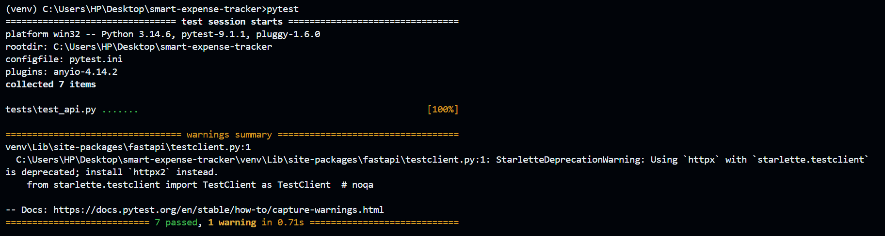
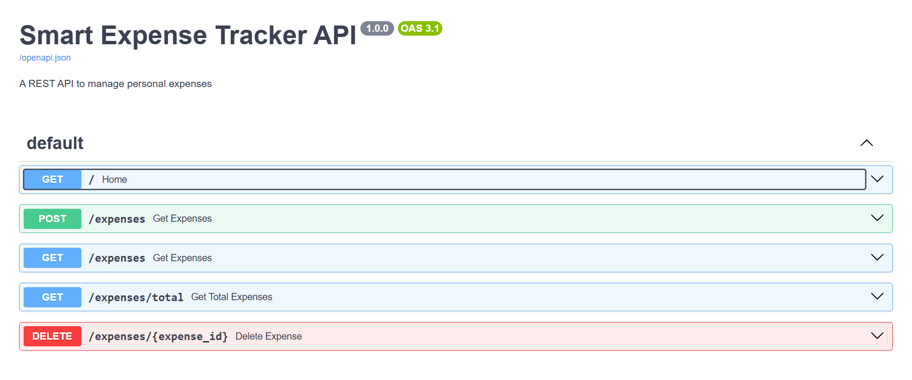

# 💰 Smart Expense Tracker REST API

A RESTful expense management API built with **FastAPI** that allows users to create, view, filter, summarize, and delete personal expense records. The project demonstrates REST API design, request validation, modular backend architecture, JSON-based data persistence, and automated testing.

---
## 🌐 Live Demo

- **Live API:** https://smart-expense-tracker-mpo7.onrender.com
- **Swagger UI:** https://smart-expense-tracker-mpo7.onrender.com/docs
- 
## 🚀 Features

* ✅ Add a new expense
* ✅ View all expenses
* ✅ Filter expenses by category
* ✅ Calculate total expenses
* ✅ Calculate category-wise expense totals
* ✅ Delete an expense
* ✅ Automatic request validation using Pydantic
* ✅ Interactive Swagger/OpenAPI documentation
* ✅ Automated API testing using Pytest

---

## 🏗️ System Architecture

```text
                    Client
                       │
                HTTP Requests
                       │
               FastAPI Application
                       │
                  APIRouter
                       │
        ┌──────────────┴──────────────┐
        │                             │
 Request Validation            Storage Layer
   (Pydantic)                     (JSON)
        │                             │
        └──────────────┬──────────────┘
                       │
                 expenses.json
```

---

## 🛠️ Technology Stack

* Python 3
* FastAPI
* Pydantic
* Pytest
* Uvicorn
* JSON (Local Storage)

---

## 📁 Project Structure

```text
smart-expense-tracker/
│
├── README.md
├── AI_NOTES.md
├── requirements.txt
├── pytest.ini
├── .gitignore
│
├── src/
│   ├── __init__.py
│   ├── main.py
│   ├── routes.py
│   ├── models.py
│   ├── storage.py
│   └── expenses.json
│
└── tests/
    └── test_api.py
```

---

## ⚙️ Installation

Clone the repository:

```bash
git clone https://github.com/DecodingAzero/smart-expense-tracker.git
cd smart-expense-tracker
```

Install the required dependencies:

```bash
pip install -r requirements.txt
```

---

## ▶️ Running the Application

Start the FastAPI development server:

```bash
uvicorn src.main:app --reload
```

The application will be available at:

```text
http://127.0.0.1:8000
```

Interactive API documentation (Swagger UI):

```text
http://127.0.0.1:8000/docs
```

---

## 🧪 Running the Tests

Execute the automated test suite:

```bash
pytest
```

All API endpoints and request validation are covered by automated tests.

### Test Results



---

## 📚 API Endpoints

| Method | Endpoint                        | Description                    |
| :----- | :------------------------------ | :----------------------------- |
| GET    | `/`                             | Welcome endpoint               |
| POST   | `/expenses`                     | Create a new expense           |
| GET    | `/expenses`                     | Retrieve all expenses          |
| GET    | `/expenses?category=Food`       | Filter expenses by category    |
| GET    | `/expenses/total`               | Calculate total expenses       |
| GET    | `/expenses/total?category=Food` | Calculate category-wise totals |
| DELETE | `/expenses/{expense_id}`        | Delete an expense              |

---

## 📖 API Documentation

FastAPI automatically generates interactive API documentation using **Swagger UI** and **OpenAPI**.

After starting the server, visit:

http://127.0.0.1:8000/docs

The Swagger interface allows you to explore and test every endpoint directly from your browser.

### Swagger UI



## 🔍 Testing

The project includes automated tests covering:

* API availability
* Creating expenses
* Retrieving expenses
* Filtering by category
* Calculating totals
* Deleting expenses
* Request validation

> Consider adding a screenshot of the successful `pytest` output to showcase the passing test suite.

---

## 🚀 Future Improvements

Potential enhancements for future versions include:

* PostgreSQL or SQLite database integration
* User authentication with JWT
* Expense update endpoint (PUT/PATCH)
* Pagination and sorting
* Monthly expense analytics
* Docker support
* Cloud deployment (Render/Railway)
* CI/CD using GitHub Actions

---

## 🤖 AI Assistance

AI was used as a development and learning assistant throughout this project. Details about AI-assisted development, code verification, and design decisions are documented in **AI_NOTES.md**.

---

## 📄 License

This project is intended for educational and portfolio purposes.
